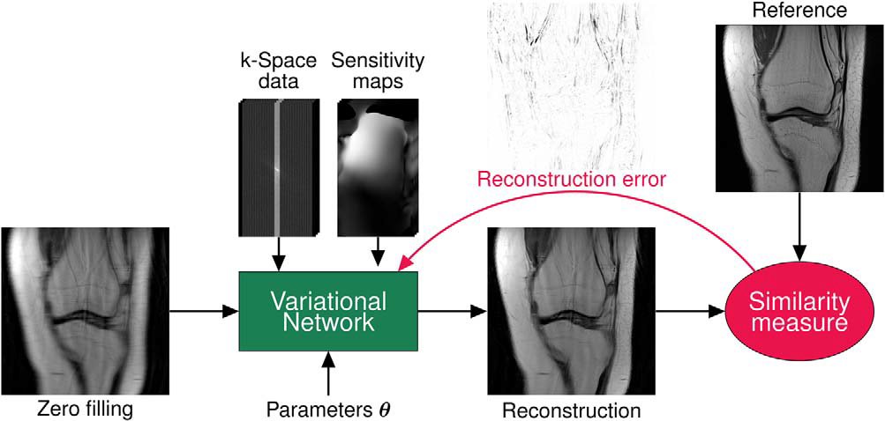
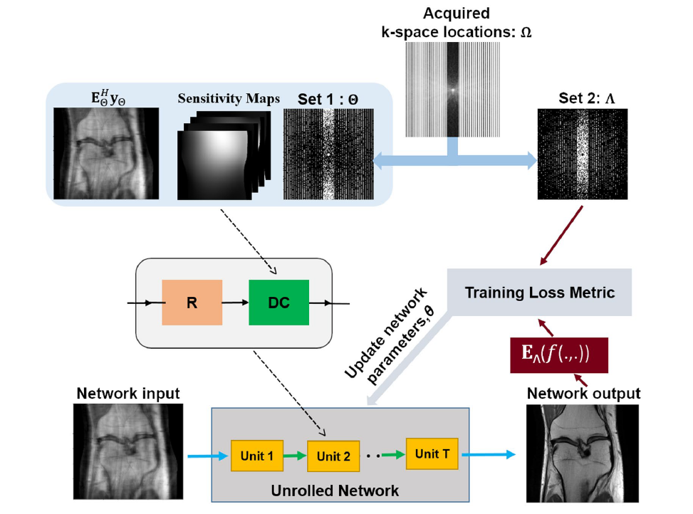

# MoDL & VarNet & SSDU

**This project compares Supervised and Self-Supervised Learning implemented by PyTorch for MRI image reconstruction.** 

MoDL: Model Based Deep Learning Architecture for Inverse Problems 

Official code: https://github.com/hkaggarwal/modl

VarNet: Learning a Variational Network for Reconstruction of Accelerated MRI Data

Official code: https://github.com/VLOGroup/mri-variationalnetwork



SSDU: Self-supervised learning of physics-guided reconstruction neural networks without fully sampled reference data

Official code: https://github.com/byaman14/SSDU



## Reference papers

MoDL: Model Based Deep Learning Architecture for Inverse Problems  by H.K. Aggarwal, M.P Mani, and Mathews Jacob in IEEE Transactions on Medical Imaging,  2018 

Link: https://arxiv.org/abs/1712.02862

IEEE Xplore: https://ieeexplore.ieee.org/document/8434321/

VarNet: Learning a Variational Network for Reconstruction of Accelerated MRI Data by Hammernik, K., Klatzer, T., Kobler, E., Recht, M. P., Sodickson, D. K., Pock, T., & Knoll, F on Magnetic Resonance in Medicine, 2018

Link: https://arxiv.org/abs/1704.00447

SSDU: Self-supervised learning of physics-guided reconstruction neural networks without fully sampled reference data by Yaman, B., Hosseini, S. A. H., Moeller, S., Ellermann, J., Uğurbil, K., & Akçakaya, M on Magnetic Resonance in Medicine, 2020

Link: https://arxiv.org/abs/1912.07669

## Dataset

The multi-coil brain dataset used in the original paper is publically available. You can download the dataset from the following link and locate in under the `data` directory.

**Download Link** : https://drive.google.com/file/d/1qp-l9kJbRfQU1W5wCjOQZi7I3T6jwA37/view?usp=sharing

For processed taining and testing fastMRI axial T2 brain datasets, you can download from the following link.
**Download Link** : https://drive.google.com/file/d/18hGurziu8zMoyyN3MvhiljvfHZCaaOaz/view?usp=drive_link

## Configuration file

The configuration files are in `config` folder. Every setting is the same as the paper.

Configuration files for K=1 and K=10 are provided. The authors trained the K=1 model first, and then trained the K=10 models using the weights of K=1 model.

## Train

You can change the configuration file for training by modifying the `train.sh` file.

```
scripts/train.sh
```

## Test

You can change the configuration file for testing by modifying the `test.sh` file.

```
scripts/test.sh
```

## Saved models

Saved models are provided.

MoDL: `workspace/base_modl,k=2/checkpoints/final.epoch0039-score19.9291.pth` 

VarNet: `workspace/base_varnet,k=2/checkpoints/final.epoch0049-score37.5461.pth`
